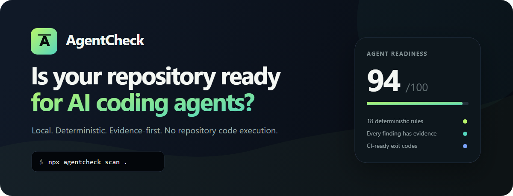
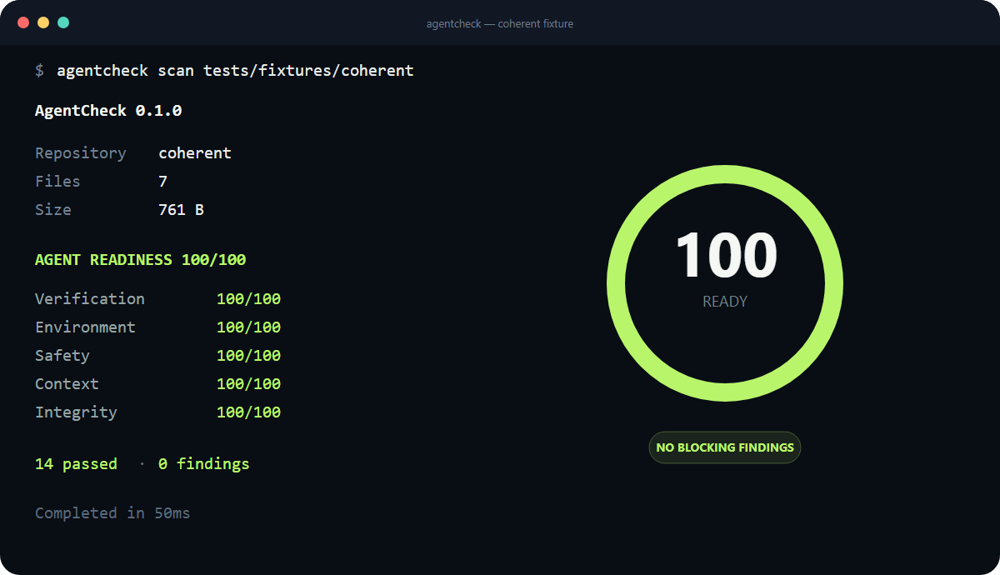
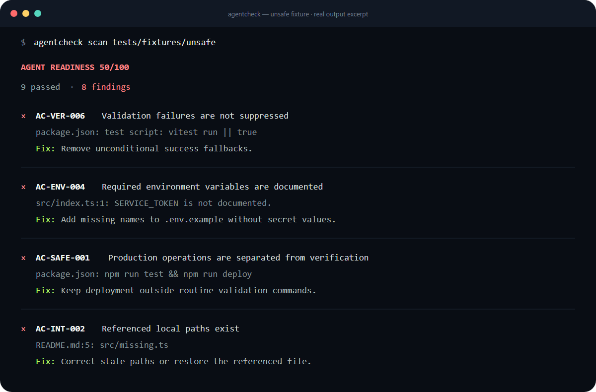

<p align="center">
  
</p>

<p align="center">
  <a href="https://github.com/DerMayer1/AgentCheck/actions/workflows/ci.yml"></a>
  
  
  <a href="./LICENSE"></a>
</p>

<p align="center">
  <strong>AgentCheck turns repository evidence into an actionable readiness score for AI coding agents.</strong><br />
  Local, deterministic, read-only, and built for CI. No account, API key, LLM, or hosted service.
</p>

---

AI coding agents are only as reliable as the repository around them. A project may build for its maintainers while still leaving an agent guessing:

- Which command proves a change is correct?
- Do the README, package scripts, and CI workflow agree?
- Which runtime and package manager should be used?
- Are required environment variables discoverable without exposing secrets?
- Can routine verification accidentally trigger a deploy or destructive command?

AgentCheck answers those questions with **18 deterministic rules** across verification, environment, safety, context, and instruction integrity. Every finding includes the exact evidence that caused it and a concrete remediation.

## Quick start

```bash
npx agentcheck scan .
```

Or install it globally:

```bash
npm install --global agentcheck
agentcheck scan /path/to/repository
```

AgentCheck scans repository text and metadata. It does **not** install dependencies, execute package scripts, import target code, write files, or access the network.

## A repository that is ready

<p align="center">
  
</p>

The score is weighted by category and applicability. Rules that do not apply are skipped instead of silently penalizing the repository.

## Findings you can act on

<p align="center">
  
</p>

This is a real excerpt from the shipped `unsafe` fixture. AgentCheck found suppressed test failures, an undocumented environment variable, deployment coupled to verification, and a stale local path. The same result is available as stable JSON for automation.

## What AgentCheck evaluates

| Category | Weight | Examples |
|---|---:|---|
| **Verification** | 30% | Test discovery, canonical verification, CI parity, type checking, visible failures |
| **Environment** | 25% | Lockfiles, Node.js constraints, package-manager consistency, documented variables |
| **Safety** | 20% | Production separation, scoped destructive commands, permission boundaries |
| **Context** | 15% | Actionable repository overview and agent instructions |
| **Integrity** | 10% | Documented scripts and referenced local paths actually exist |

List the complete installed catalog or inspect one rule:

```bash
agentcheck rules
agentcheck explain AC-SAFE-001
```

The rule IDs and JSON schema are public contracts. See the [version 0 rule catalog](./docs/RULES_V0.md) for the full design surface.

## How it works

```text
repository
    │
    ├── bounded, read-only traversal
    ├── manifest + lockfile facts
    ├── README + agent instruction facts
    ├── package script + CI workflow facts
    └── source-level environment references
            │
            ▼
    normalized evidence
            │
            ▼
    18 deterministic rules
            │
            ├── terminal report
            ├── JSON report
            └── CI exit code
```

The same repository state and configuration produce the same findings. AgentCheck does not send repository content anywhere.

## CI gates

Use a score threshold, a severity threshold, or both:

```bash
agentcheck scan . \
  --ci \
  --min-score 80 \
  --fail-on high \
  --fail-on-incomplete
```

GitHub Actions example:

```yaml
- name: Check repository readiness
  run: npx agentcheck scan . --ci --min-score 80 --fail-on high --fail-on-incomplete
```

| Exit code | Meaning |
|---:|---|
| `0` | Scan completed and all requested gates passed |
| `1` | Minimum-score gate failed |
| `2` | Invalid command or configuration |
| `3` | Analysis was incomplete and completeness was required |
| `4` | Internal AgentCheck failure |
| `5` | Severity gate failed |

## JSON output

```bash
agentcheck scan . --format json > agentcheck-result.json
```

The output conforms to the shipped [`scan-result-v1` schema](./schemas/scan-result-v1.schema.json). Schema version `1` is covered by a frozen consumer fixture and compatibility tests.

```json
{
  "schemaVersion": "1",
  "complete": true,
  "repository": { "name": "example", "gitRepository": true },
  "scores": { "overall": 94 },
  "findings": [
    {
      "ruleId": "AC-ENV-004",
      "status": "fail",
      "severity": "high",
      "evidence": [
        { "path": "src/index.ts", "line": 1, "message": "API_TOKEN is not documented." }
      ]
    }
  ]
}
```

The example is abbreviated; consumers should use the schema rather than this snippet as the complete contract.

## Repository configuration

Create `.agentcheck.json` at the repository root:

```json
{
  "ignore": ["generated/**", "vendor/**"],
  "rules": {
    "AC-CTX-002": "warn",
    "AC-SAFE-002": "error",
    "AC-INT-002": "off"
  },
  "limits": {
    "maxFiles": 25000,
    "timeoutMs": 8000
  },
  "gates": {
    "minScore": 80,
    "failOn": "high",
    "failOnIncomplete": true
  }
}
```

Rule levels are `off`, `warn`, and `error`. Explicit CLI gate options override configured gates. Configuration is validated before traversal against strict size, count, and value limits; the schema is available at [`config-v1.schema.json`](./schemas/config-v1.schema.json).

## Commands

```text
agentcheck scan [path]          Analyze a repository without executing it
agentcheck rules                List all installed deterministic rules
agentcheck explain <rule-id>    Explain a rule and its remediation
agentcheck --version            Print the installed version
agentcheck --help               Show command help
```

## Safety and performance boundaries

AgentCheck treats the target as untrusted input:

- symbolic links and directory junctions are reported but never followed;
- traversal is bounded by depth, file count, individual file size, total bytes, and time;
- `.git`, dependency, build, cache, and coverage directories are excluded;
- configuration and manifests are parsed as inert JSON;
- extracted commands are compared as text and never passed to a shell.

The release benchmark scans **2,501 files in under 5 seconds** in CI. The current measured baseline and default limits are documented in [Performance](./docs/PERFORMANCE.md); the complete trust boundary is documented in [Security](./docs/SECURITY.md).

## Current scope

Version `0.1` targets Node.js and TypeScript repositories and recognizes the major package-manager conventions in that ecosystem. AgentCheck remains useful on partially recognized repositories, but unsupported ecosystems do not yet receive dedicated rule packs.

Explicitly out of scope for `0.1`:

- executing a repository's tests, builds, or scripts;
- generating or modifying repository files;
- LLM-based analysis;
- hosted dashboards, accounts, shareable readiness badges, or telemetry;
- SARIF, HTML, and additional language rule packs.

## Develop locally

Requires Node.js 22.12 or newer.

```bash
git clone https://github.com/DerMayer1/AgentCheck.git
cd AgentCheck
npm install
npm run verify
npm run dev -- scan tests/fixtures/coherent
```

Useful release checks:

```bash
npm run benchmark
npm run smoke:package
```

The test suite includes coherent and unsafe repositories, golden terminal/JSON contracts, traversal security boundaries, schema compatibility, and installation from the actual npm tarball. Package smoke tests run on Windows, macOS, and Linux in CI.

## Documentation

- [Architecture](./docs/ARCHITECTURE.md)
- [Rule catalog](./docs/RULES_V0.md)
- [Implementation roadmap](./docs/ROADMAP.md)
- [Performance contract](./docs/PERFORMANCE.md)
- [Static scan security boundary](./docs/SECURITY.md)
- [Release procedure](./docs/RELEASING.md)

## License

[MIT](./LICENSE) © AgentCheck contributors.
